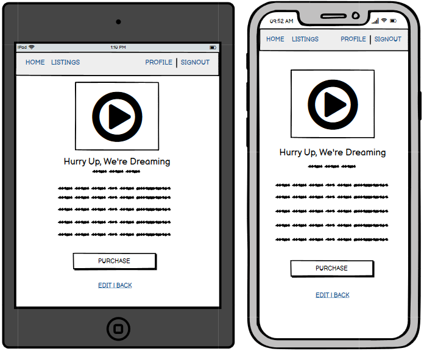
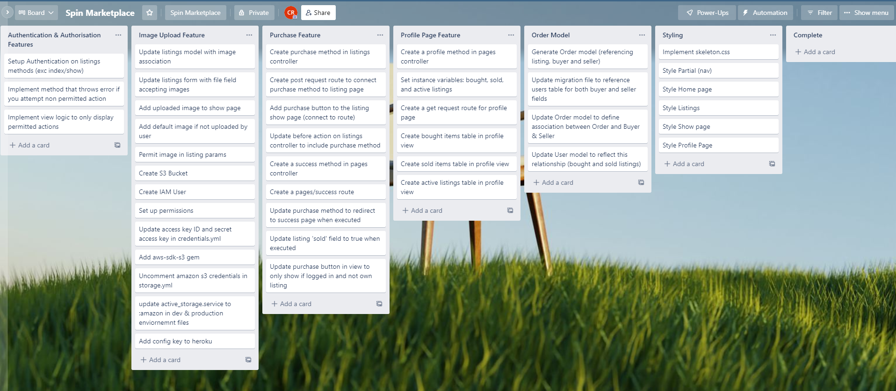

## R7) Identification of the problem you are trying to solve.
Physical music products have well and truly lost the battle to digital music sales and streaming services, with CD sales seeing consistent declines in favour of services like Apple music and Spotify. Curiously, an even older physical music technology has entered a renaissance over the last decade – the vinyl record. The movement was seeded as a grassroots cultural one rather than an engineered commercial push. Consumers have been driven by a desire for a physical connection to an industry that is becoming increasingly digital, combined with the notion that records have a superior sound to digital representations. 

The size of this market has also never been more evident than now - last year (2021) vinyl record sales finally surpassed the domestic CD market by  generating $29.7 million in retail sales, in comparison to the $24.9 million generated by CDs. While there are several Australian websites that sell vinyl  directly, there isn't a two-way online marketplace solely dedicated to the sale of second hand records that is built for the domestic Australian market that has gained significant user uptake. 

## R8) Why is it a problem that needs solving?

With the increasing sale of vinyl domestically, there is a naturally increasing demand for marketplaces that facilitate the purchase and sale of second hand records. Currently second hand records are primarily being sold to bricks and mortar stores, and on general marketplace websites like gumtree, ebay, and Facebook Marketplace. This application looks to cater to this market, while profiting from advertising revenue, and a percentage of all sales (facilitated on the platform by a third party payment provider). 

## R9) A link (URL) to your deployed app (i.e. website) 
[Deployed App On Heroku](https://staging-spin-app.herokuapp.com/)


## R10) A link to your GitHub repository
[Github Repo](https://github.com/connorca22/spin-marketplace/tree/dev) 

## R11) Description of your marketplace app

### Purpose
The application is designed to allow users to browse, and purchase vinyl records, as well as listing and selling them. The app facilitates this process and is funded by on-site digital advertising revenue as well as transaction fees (when payment processing is implemented at a later stage). 

### Sitemap


### Screenshots
 
 
 
 
 

### Functionality 
- Sign up, sign in, and sign out functionality using Devise. 
Browse listings on the listings page (displays title, artist, genre, price, etc) 
- Devise allows for segmentation of member functionality through authentication and authorisation features implemented throughout the app (only members can create, edit, and delete listings, or access their profile page). 
- If you're logged in you can create a listing which allows you to input details relating to the record, as well as uploading cover art. You can also edit/delete your own listings.   
- On individual listing pages you can view the record art image, as well as all relevant details, and if you're logged in you'll have the ability to make a purchase of items you do not own. 
- If you're logged in you can navigate to your profile page, which displays active listings, sold listings, and bought items. 

### Target Audience
- Music lovers  
- Vinyl enthusiasts  
- Record collectors 
- DJ's 
- Resellers 

### Tech Stack
- **Programming Language:** Ruby 2.7.5 
- **Server Side Framework:** Rails 6.1.6 
- **Database:** Postgresql  
- **Version Control:** Git and Github  
- **Deployment:** Heroku  
- **Image Storage:** AWS S3  
- **Gems:** 
    - Devise 4.8 (Authentication & Authorisation) 
    - AWS SDK S3 1.114 (to utilise AWS S3)  
- **Front End:** 
    - HTML (implemented inside .erb files)
    - SCSS 
    - Skeleton.css 


## R12) User stories for your app 

**User Story: Buyer**
- As a buyer I want to be able to buy second hand records so that I do not have to pay full price on brand new records. 
- As a buyer I want to be able to buy second hand records because many records are no longer available commercially and you can only find them second hand. 
- As a buyer I want to be able to view all records listed in one centralised location so that I can quickly understand what's available for purchase 
- As a buyer I want all details relevant to the identity, condition, and status of the item featured on the listing so that I can make a purchase decision without further inquiry. 
- As a buyer, in order to keep track of past purchases, I want to be able to see previous orders. 
- As a buyer, in order to understand the condition of the record, I want its condition rated by the seller. 
- As a buyer, in order to verify the condition of the record, I want the seller to upload a photo of it 

**User Story: Seller**
- As a seller I want to sell my second hand records directly to buyers because it can net a much larger sale price than selling to record stores or second hand stores. 
- As a seller I want to be able to create listings so that I can sell my second hand records
- As a seller, in order to give buyers all relevant information on the record, I want to be able to populate fields regarding record identity, condition, genre, price, etc on the listing. 
- As a seller I want to be able to log in so that the web app stores all data relevant to my activity, listings and transactions. 
- As a seller, in order to keep track of my current listings, I want access to a page that displays my unsold listings. 
- As a seller, in order to keep track of my sold items, I want access to a page that displays listings that I've sold 
- As a seller I want to be able to delete my listing, so that I'm able to remove it if no longer required. 
- As a seller I want to be able to edit my listing, so that I can adjust details if required. 

## R13) Wireframes for your app 

### Home Page
 
 

### Listings  
 
 

### Listing 
 
 

### Profile 
 
 

### Success Page
 
 

## R14) An ERD for your app 


## R15) Explain the different high-level components (abstractions) in your app 
The Spin marketplace application utilises the Model View Controller (MVC) design pattern, which distinguishes the application into three main components: the Model, the View, and the Controller. 

### Model
The Model is responsible for structuring and storing data relevant to the application. In Rails, this is managed by the ActiveRecord module which is the interface between the application and the database it's connected to. All of the models in the app inherit from the ApplicationRecord class, which inherits from ActiveRecord. Any customisations and extensions that need to be inherited by models would be written in the ApplicationRecord class, which is the intermediary layer between models and ActiveRecord. 

The main models in the application are:
- Listing
- Order
- Product Type 
- User 

### View 
The View component facilitates the representation of the graphical user interface in the application. It's found in the views directory, and is composed of .erb files which is a format used to embed ruby into html, and facilitates dynamic rendering of web content. Data is pulled into the view files by referencing instance variables defined in the associated controller, which provides much of that data by interacting with the model to extract information from the database. Every page on the website is represented by a view file, but view files can also contain reusable components called partials that host content like navbars and forms. Below are the main views (and associated controller methods) in the Spin marketplace app. 

**Pages**
- Home (home page) 
- Profile (page that hosts user's purchase and listing history) 
- Success (page users are directed to when purchase is successful) 

**Listings**  
- Index (all listings page)
- Show (individual listing pages) 
- New & Edit (pages that allow you to create & update listings) 
- Form Partial (form contained within partial that's rendered into the 'new' and 'edit' pages) 

**Devise**  
Contains many views, the primary ones we work with are the Edit & New .erb files in the registrations directory, which represent the sign up form.  

**Shared**
Contains our navbar partial file 

**Layouts**  
Contains our application.html.erb file – which yields all of our views inside the <body> tags. When we add elements to this file, they appear in every page on the app (e.g navbar partial, rails console, etc). 


### Controller 
The controller is the intermediary between the Model and the View. The views in the application rely on their associated controllers to access data from the relevant models and pass it to them, and if data is collected in the views that requires the database to be updated, the model relies on the controller to contain and process the logic that implements these changes. Below are the main controllers used in the application. 

- Listings (handles CRUD logic for listings) 
- Pages (contains logic for profile page, and blank methods for home & success pages) 
- User (devise controller – cannot access) 
- ApplicationController (used  to implement Devise controller functionality via inheritance)

It's important to note that all controllers inherit from the ApplicationController, which itself inherits from ActionController. When I updated the User signup form to include a “username” field, I also defined a method in the ApplicationController which permitted the inclusion of this new input, as well as a before_action which only ran the method if on a Devise controller. We did this because the User was created using Devise (meaning we cannot access or edit its controller), and by including this method in the ApplicationController, the User controller would inherit this functionality. 


## R16) Detail any third party services that your app will use 

**Postgresql:** Postgresql is an open source relational database management system that supports SQL and JSON querying. This was implemented as the application's database. 

**Github:** Github is a cloud based git repository that I utilised to store, manage, and keep track of code base updates, using a feature branch workflow. 

**Heroku:** A cloud platform as a service that is utilised for running applications in dynos (lightweight linux containers that run application processes). The application is deployed via heroku, and is set up in a pipeline, allowing us to deploy to a staging application before upgrading to production. Deployment was automated by linking the staging application to the Github repository. 

**AWS S3:** AWS S3 provides object storage services. I implemented AWS S3 as a way to store product images uploaded by the user on listings pages. It was used in conjunction with AWS IAM for identity and access management. 

**Devise:** An authentication system for Rails applications, that contains functionality for user registration, password recovery, session management, account security, and more. In the marketplace application we use this to generate our User model, controller, and views, etc, so that only registered users can access certain functionality. We also use some of Devise's built-in features to implement some basic authorisation. 

**Skeleton.css:** A lightweight, responsive CSS library based on a 12-column grid. Generally this is used for smaller projects that don't require the functionality of larger frameworks like Bootstrap. I implemented this to quickly implement a basic level of styling, by adding skeleton class names to html elements in the views. 

## R17) Describe your projects models in terms of the relationships (active record associations) they have with each other 

**User**
The User model which was generated using Devise represents a registered user of the site. Logically a user can have many or no listings, and can have many or no orders. Orders are referenced twice because a user can be associated with a user as a seller, or a buyer, so the User model is referenced on the Order model twice with “buyer_id” and “seller_id”.  Associations below. 
```
has_many :listings 
has_many :bought_orders, foreign_key: "buyer_id", class_name: "Order" 
has_many :sold_orders, foreign_key: "seller_id", class_name: "Order" 
```

**Order**
An order can logically have only one listing – so it “belongs to” the Listing model. There are two foreign keys for the User model in the Orders table – buyer_id and seller_id. This is because an Order needs to keep track of buyer, as well as the seller. Associations below. 
```
belongs_to :listing
belongs_to :buyer, foreign_key: "buyer_id", class_name: "User"
belongs_to :seller, foreign_key: "seller_id", class_name: "User"
```

**Listing**
A listing belongs to the User model, because it can only be associated with one user (the seller). It also belongs to the ProductType model, because each listing can only be associated with a single product category. Associations below. 
```
belongs_to :user
belongs_to :product_type
```

**Product Type**
The ProductType model contains three values - “Single”, “EP”, and “LP”. Each of these can be associated with many listings (e.g many records can be categorised as LPs), but a listing can only have a single Product Type. Associations below. 
```
has_many Listings 
```

## R18) Discuss the database relations to be implemented in your application 
The **Users table** keeps track of registered users. It's important for authentication, and some of its built-in Devise functionality (like the current_user helper), helps us to implement basic authorisation. As demonstrated below, it has a one to many relationship with Listings and Orders, meaning it can have many or no associated listings/orders. It is represented in two foreign keys on the Order table - seller_id, and buyer_id. 

The **Listings table** keeps track of the records that are listed by users. It's the main content of the application, users create them to sell their records, and can also purchase them, and in doing so create an order. Listings have one to many relationship with the users, in that a listing must only have one user (the seller), but a user can create many listings, or none.  

The **Product Type** table is used to categorise listings into specific product groups. At this stage it includes the three main types of records – singles, EPs, and LPs. The Product Type table has a many to one relationship with listings, in that a Product Type can have many listings, but an individual listing can only have one product type. 

The **Order table** was created to keep track of record purchases by centralising the buyer, seller, and listing details into one record. The Order table has a one to many relationship with Users, in that an order must have one user (in this case User refers to two users, the seller and the buyer), and a user can have many or no orders. Orders also has a one to one relationship with Listings - in that every order must have a listing, and every listing can have one or no orders. 

The **Active Storage Blobs table** contains the data related to the uploaded image, including details like file name, file type, byte size, etc. It has a one to one relationship with attachments, in that every attachment must have one blob and visa versa. 

The **Active Storage Attachments table** joins the Active Storage Blob with the relevant record. In this case the record is each listing. This table has a one to one relationship with blobs as described above. 

The **Active Storage Variant Records table** contain transformations of the original image which can be used in different contexts (like thumbnails). A variant is generated by downloading the image, converting it into a variant, and then storing it in AWS S3. It has a one to many relationship with Active Storage Blobs - in that reach variant record must have one blob, but blobs can have zero or many variant records. 

## R19) Provide your database schema design 
Find the ERD at R14. Find descriptions of active record associations and relations in R17 & R18. 

```
ActiveRecord::Schema.define(version: 2022_07_16_065321) do

  create_table "active_storage_attachments", force: :cascade do |t|
    t.string "name", null: false
    t.string "record_type", null: false
    t.bigint "record_id", null: false
    t.bigint "blob_id", null: false
    t.datetime "created_at", null: false
    t.index ["blob_id"], name: "index_active_storage_attachments_on_blob_id"
    t.index ["record_type", "record_id", "name", "blob_id"], name: "index_active_storage_attachments_uniqueness", unique: true
  end

  create_table "active_storage_blobs", force: :cascade do |t|
    t.string "key", null: false
    t.string "filename", null: false
    t.string "content_type"
    t.text "metadata"
    t.string "service_name", null: false
    t.bigint "byte_size", null: false
    t.string "checksum", null: false
    t.datetime "created_at", null: false
    t.index ["key"], name: "index_active_storage_blobs_on_key", unique: true
  end

  create_table "active_storage_variant_records", force: :cascade do |t|
    t.bigint "blob_id", null: false
    t.string "variation_digest", null: false
    t.index ["blob_id", "variation_digest"], name: "index_active_storage_variant_records_uniqueness", unique: true
  end

  create_table "listings", force: :cascade do |t|
    t.string "title", null: false
    t.string "artist", null: false
    t.integer "condition", null: false
    t.integer "genre", null: false
    t.integer "price", null: false
    t.boolean "sold", default: false
    t.bigint "user_id", null: false
    t.bigint "product_type_id", null: false
    t.datetime "created_at", precision: 6, null: false
    t.datetime "updated_at", precision: 6, null: false
    t.index ["product_type_id"], name: "index_listings_on_product_type_id"
    t.index ["user_id"], name: "index_listings_on_user_id"
  end

  create_table "orders", force: :cascade do |t|
    t.bigint "listing_id", null: false
    t.bigint "buyer_id", null: false
    t.bigint "seller_id", null: false
    t.datetime "created_at", precision: 6, null: false
    t.datetime "updated_at", precision: 6, null: false
    t.index ["buyer_id"], name: "index_orders_on_buyer_id"
    t.index ["listing_id"], name: "index_orders_on_listing_id"
    t.index ["seller_id"], name: "index_orders_on_seller_id"
  end

  create_table "product_types", force: :cascade do |t|
    t.string "name"
    t.datetime "created_at", precision: 6, null: false
    t.datetime "updated_at", precision: 6, null: false
  end

  create_table "users", force: :cascade do |t|
    t.string "email", default: "", null: false
    t.string "encrypted_password", default: "", null: false
    t.string "reset_password_token"
    t.datetime "reset_password_sent_at"
    t.datetime "remember_created_at"
    t.string "username"
    t.datetime "created_at", precision: 6, null: false
    t.datetime "updated_at", precision: 6, null: false
    t.index ["email"], name: "index_users_on_email", unique: true
    t.index ["reset_password_token"], name: "index_users_on_reset_password_token", unique: true
  end

  add_foreign_key "active_storage_attachments", "active_storage_blobs", column: "blob_id"
  add_foreign_key "active_storage_variant_records", "active_storage_blobs", column: "blob_id"
  add_foreign_key "listings", "product_types"
  add_foreign_key "listings", "users"
  add_foreign_key "orders", "listings"
  add_foreign_key "orders", "users", column: "buyer_id"
  add_foreign_key "orders", "users", column: "seller_id"
end
```

## R20) Describe the way tasks are allocated and tracked in your project
I broke the project into two stages: planning, and a build & deploy cycle. In the planning stage I worked through several of the Readme documentation questions and decided on the project, mapped out the problem it solved and the target audience. From there I defined the functionality required to create an MVP, and broke the required features into several categories comprised of many subtasks each. I took these tasks and input them into a Trello board in order to track and manage the development workflow. I separated each feature into its own list and organised these lists linearly according to build order. From here I moved into the build & deploy cycle, which was the process of building a feature, deploying it to Heroku, fixing any bugs in the code, and moving on to the next feature. The first two screesnhots below were captured at the beginning of the project. The final screenshot was captured towards the end. 



